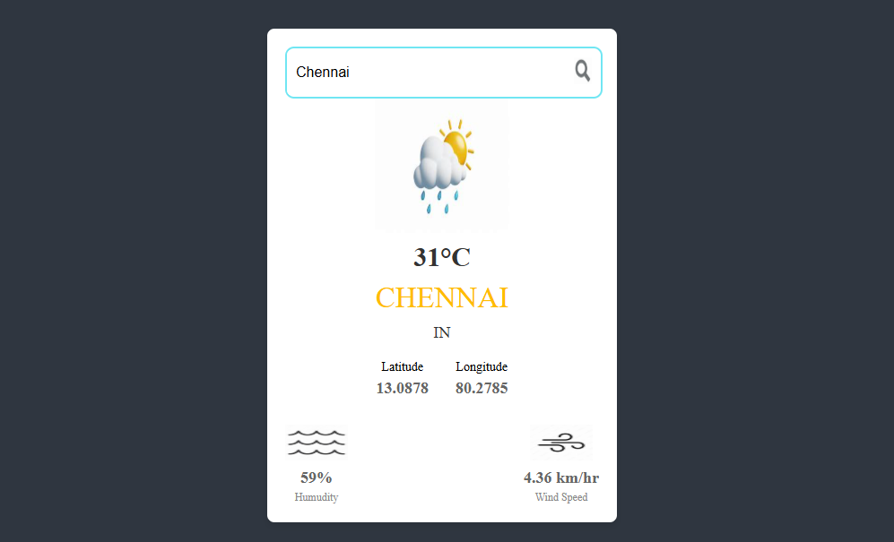

## 🌦️ Weather App
A simple React-based Weather Application that fetches real-time weather data using the OpenWeatherMap API.
Users can search for any city to view its current temperature, location details, humidity, and wind speed.

## ✨ Features
🌍 Search weather by city name

🌡️ Displays temperature in Celsius

📍 Shows country, latitude, and longitude

💧 Humidity and 💨 wind speed indicators

## 📸 Dynamic weather icons based on weather condition

⚡ Error handling for city not found and network errors

⏳ Loading indicator while fetching data

## 🛠️ Tech Stack
Frontend: React.js, CSS

API: OpenWeatherMap API

## 📸 Screenshot

Here's how the weather app looks:

## ⚙️ Functionality Overview
useState hooks are used to store weather details like temperature, humidity, city name, etc.

useEffect triggers an API call when the app first loads.

WeatherDetails Component displays fetched weather data.

Dynamic icons are shown based on the weather condition codes.

Input field allows users to type a city and press Enter or click the search icon to update weather details.

## Site
Site Link: https://appweatherpro.netlify.app/
